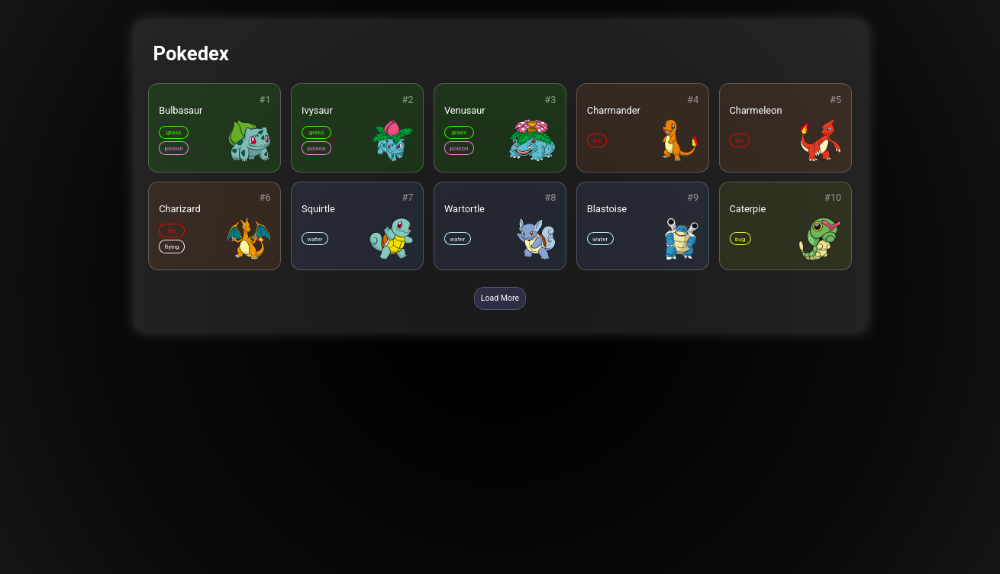

# Pokedex

> 📖 [Leia esta página em Português](./README.pt.md)

A Pokédex project developed as a personal initiative, using HTML, CSS, and JavaScript. This project aims to display information about Pokémon in an interactive and visually appealing way, simulating the experience of a classic Pokédex from the Pokémon universe.

## Features

- **Details Display:** View detailed information such as type, abilities, height, weight, and official image.
- **Navigation:** Browse through Pokémon sequentially or directly.
- **Responsive Design:** Layout adapts to different devices, including desktop and mobile.

## Technologies Used

- **HTML:** Project structure.
- **CSS:** Styling and responsiveness.
- **JavaScript:** Search logic, data handling, and interactivity.

## How to Run

1. Clone the repository:
   ```bash
   git clone https://github.com/GeovanniJDA/Pokedex.git
   ```
2. Enter the project folder:
   ```bash
   cd Pokedex
   ```
3. Open the `index.html` file in your browser.

## Images



## Next Steps

- Implement filtering by Pokémon type.
- Add favorites and advanced search system.
- Improve interface accessibility.

## Contribution

Feel free to open issues or pull requests with suggestions, fixes, or improvements!

## License

This project is licensed under the MIT License.

---

> Made with ❤️ by [GeovanniJDA](https://github.com/GeovanniJDA)
